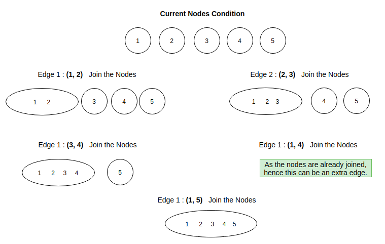

# Redundant Connection

> **Problem Link** : [Redundant Connection (LeetCode)](https://leetcode.com/problems/redundant-connection/) <br>
> **Concepts Involved** : *Tree, Disjoint Union Set* 

## Problem Statement
We have been provided with a list of edges. These edges form a Tree. The list has one extra edge as well. We have to find that extra edge which if removed from the list makes the resulting list of edges a Tree of N nodes.

## Solution
<p>
We have been given with a list of edges. Now we need to remove one edge from the List so that the resultant list forms a Tree. Basically a Tree can be termed as a special Graph where every nodes are connected to one another directly or indirectly and there no loops present. As there is only one extra edge, then it must join two nodes which are already connected. And we neeed to find that particular edge.
</p>
<p>
The basic idea is to use a Disjoint Union Sets here. We will iterate over the list of edges and for every edge <b>(u,v)</b> we will put u and v in a single set. If during the iteration we find an edge such that both the nodes u and v is in the same set, then we can say that it is an extra edge which can be removed. We can store that as our result and return it after the iteration.
</p>



<p>
The basic source code for the problem looks like :

```
    for each (edge in edge_list) :
        if(same_set(edge.u, edge.v)){
            extra_node_u = edge.u
            extra_node_v = edge.v
        }
        else{
            put_in_same_set(edge.u, edge.v)
        }
    }  
```
</p>

## Complexity
  * The solution Time Complexity is : ***O(N)***
  * The solution Space Complexity is : ***O(N)***
  
> **Author's Note** : I would highly encourage readers to learn the Disjoint Set Union data structure before attempting the question from [here](https://www.geeksforgeeks.org/union-find/).
